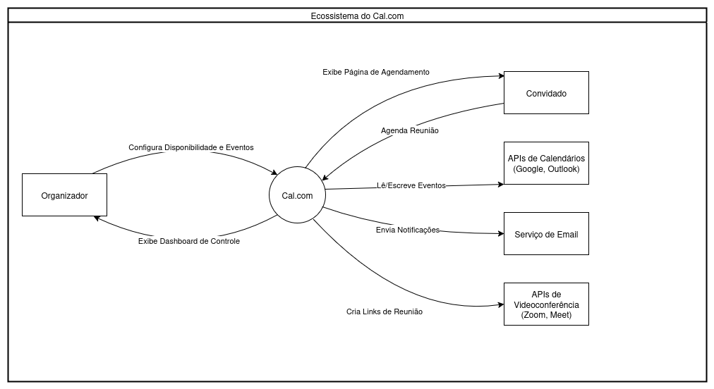

# Requisitos de avaliação

## 1. **Propósito da Avaliação**

O propósito desta avaliação é analisar a qualidade do software **Cal.com** sob as perspectivas de Portabilidade e Adequação Funcional. A avaliação busca fornecer uma visão abrangente da qualidade do produto, identificando pontos fortes e fracos do sistema nessas áreas, com base na norma ISO/IEC 25010[^2].

### 1.1. Uso Pretendido

Os resultados obtidos servirão para os seguintes propósitos[^1]:

* **Informar Tomadas de Decisão:** Fornecer subsídios para futuras melhorias, tomadas de decisão sobre releases e priorização de desenvolvimento.
* **Garantir a Aderência a Padrões:** Assegurar que o software atende aos padrões de qualidade definidos, tanto internos quanto externos.
* **Melhorar a Qualidade do Produto:** Identificar oportunidades de melhoria no processo de desenvolvimento e na qualidade do produto final.
* **Fornecer Feedback para a Equipe:** Apresentar um feedback construtivo para a equipe de desenvolvimento, destacando áreas que necessitam de atenção.

---

## 2. **Requisitante e Partes Interessadas (Stakeholders)**

Para auxiliar na avaliação de qualidade do Cal.com, vamos identificar as partes interessadas, seus papéis e como os resultados desta análise influenciam suas decisões e critérios de sucesso. Vale ressaltar que o Cal.com não possui documentação oficial que informe seus principais stakeholders. Por isso, a equipe Hedy Lamarr decidiu fazer esse levantamento, considerando os principais usuários e suas interações com a plataforma.

### 2.1. Usuários Finais

* Papel: São os indivíduos e equipes que utilizam o Cal.com no dia a dia para gerenciar suas agendas e marcar reuniões. Este grupo pode incluir desde profissionais autônomos e freelancers até equipes inteiras dentro de grandes empresas, além dos clientes e convidados que interagem com a plataforma para marcar um horário.

* Influência na Avaliação: Para este grupo, a avaliação de qualidade serve como um fator de confiança e eficiência.

* Critério de Sucesso: O sucesso é medido pela capacidade de agendar reuniões de forma eficiente e sem atritos. A avaliação confirma se a ferramenta possui as funcionalidades necessárias e se funciona de maneira consistente em qualquer dispositivo ou navegador que eles ou seus convidados utilizem, garantindo confiança e uma boa experiência de uso.

### 2.2. Compradores e Gestores

* Papel: Representam as empresas ou equipes que estão considerando adquirir ou adotar o Cal.com como solução de agendamento padrão. Podem ser gestores de TI, chefes de departamento ou donos de pequenas empresas.

* Influência na Avaliação: Este grupo utiliza a avaliação como uma ferramenta para justificar a decisão de compra e mitigar riscos.

* Critério de Sucesso: O sucesso é a adoção de uma ferramenta que resolva as necessidades da empresa com baixo custo de implementação e suporte. A avaliação valida se o Cal.com atende aos requisitos do negócio e se é compatível com o ambiente tecnológico da organização, garantindo o retorno sobre o investimento.

### 2.3. Equipe de Desenvolvimento e Manutenção do Cal.com

* Papel: São os engenheiros, designers e gerentes de produto responsáveis por construir, manter e evoluir o software Cal.com.

* Influência na Avaliação: Para a equipe de desenvolvimento, esta avaliação externa é uma fonte valiosa de feedback para identificar ações corretivas e definir estratégias de evolução do produto.

* Critério de Sucesso: O sucesso está em obter indicadores que auxiliem na construção de um produto estável, competitivo e com alta satisfação do usuário. Esta avaliação externa fornece um feedback acionável, apontando falhas e melhorias tanto nas funcionalidades (adequação funcional) quanto na consistência da experiência entre plataformas (portabilidade), orientando o desenvolvimento.

### 2.4. Equipe de Marketing e Vendas

* Papel: São os profissionais responsáveis por comunicar o valor do Cal.com ao mercado, atrair novos clientes e posicionar o produto frente a concorrentes como o Calendly.

* Influência na Avaliação: A avaliação de qualidade fornece argumentos concretos para serem usados como diferencial competitivo.

* Critério de Sucesso: O sucesso é comunicar o valor do produto de forma convincente para gerar vendas, posicionando o Cal.com como uma solução robusta em funcionalidades e, ao mesmo tempo, flexível e acessível em qualquer dispositivo.

---

## 3. **Tipo de Produto e Descrição do Software**

Para classificar o Cal.com, é possível utilizar duas óticas complementares: o modelo de negócio e o domínio de aplicação.

### 3.2 Classificação por Modelo de Negócio: COTS (Commercial Off-The-Shelf)[^3]

O Cal.com se encaixa bem na categoria COTS, pois é um produto padronizado, oferecido como um modelo SaaS (Software as a Service) ou via auto-hospedagem (self-hosting) de seu código aberto[^4]. Todos os usuários utilizam a mesma base de código e funcionalidades, que são atualizadas de forma centralizada pelo desenvolvedor, se encaixando perfeitamente no modelo COTS.

### 3.3 Classificação por Domínio de Aplicação: Software Comercial

De acordo com a classificação de Pressman[^5], o Cal.com é um Software Comercial (Business Software), pois é um software desenvolvido com o objetivo dar suporte a operações comerciais e decisões administrativas, automatizando tarefas e processando informações de negócio.

A plataforma ao otimizar e automatizar o processo de agendamento de reuniões, uma tarefa essencialmente administrativa e comercial, se enquadra perfeitamente na categoria citada acima, permitindo o aumento da eficiência e produtividade dos seus usuários.

### 3.4 Principais Funcionalidades

O sistema é composto por um conjunto coeso de funções, incluindo:

1) Criação e gestão de tipos de eventos (ex: reunião de 30 min, chamada de 1 hora).

2) Integração com calendários externos (Google Calendar, Outlook 365, etc.).

3) Disponibilização de páginas públicas de agendamento.

4) Detecção automática de fuso horário.

5) Envio de notificações e lembretes por e-mail.

6) Gestão de agendamentos (cancelamento, reagendamento).

7) Integração com aplicativos de videoconferência (Zoom, Google Meet).

Durante a avaliação o foco será principalmente em duas funções:

1) **Motor de Agendamento**: A lógica de verificação de disponibilidade em múltiplos calendários e fusos horários é o coração do sistema e a mais crítica. Falhas aqui comprometem todo o produto.

2) **Serviço de Integração**: A robustez e a confiabilidade das conexões com APIs de terceiros (calendários, videoconferências) são cruciais para a experiência do usuário.

### 3.5 Diagrama de Contexto[^6]

O diagrama abaixo ilustra o Cal.com em seu ecossistema, mostrando as principais interações com usuários e sistemas externos.

O diagrama de contexto deixa claro que a qualidade das integrações é tão importante quanto a do próprio software, portanto, o plano de ação de avaliação deve incluir testes rigorosos de interação com as APIs de Calendário e Videoconferência, verificando a corretude e tratamento de erros.

---

## 4. **Seleção e priorização de características**

No presente trabalho, foram avaliadas diferentes características de qualidade da norma **SQUARE** com o objetivo de selecionar e priorizar aquelas mais relevantes para análise do software **Cal.com**.  

### 4.1 Seleção de características

O *Cal.com* é um sistema web para agendamento de reuniões que depende de integração com outros calendários e de acesso multiplataforma. Considerando esse contexto e o perfil dos usuários (corporativos e pessoais, com acesso via desktop e dispositivos móveis), foram inicialmente consideradas todas as características da norma SQUARE, por refletirem os fatores críticos de sucesso do software:

- **Adequação funcional** – fornecer corretamente as funções de agendamento e integração com serviços externos.  
- **Eficiência de desempenho** – otimizar tempo de resposta e uso de recursos do sistema.  
- **Compatibilidade** – capacidade de operar em conjunto com outros softwares e sistemas.  
- **Usabilidade** – facilidade de aprendizado e uso pelo usuário final.  
- **Confiabilidade** – manter funcionamento estável e sem falhas críticas durante o uso.  
- **Segurança** – proteção de dados e controle de acesso de usuários.  
- **Manutenibilidade** – facilidade de atualização, correção e evolução do sistema.  
- **Portabilidade** – garantir uso adequado em diferentes dispositivos, sistemas operacionais e navegadores.  

### 4.2 Método de priorização: Matriz Impacto × Risco

Para priorizar as características, utilizamos a **Matriz Impacto × Risco**, atribuindo valores de 1 (baixo) a 5 (alto) para cada dimensão:  

- **Impacto**: grau em que a característica influencia diretamente a experiência do usuário e o sucesso do software.  
- **Risco**: probabilidade de falhas ou limitações nessa característica comprometerem o uso do sistema.  

A pontuação final (I × R) permitiu ordenar as características por prioridade, tornando o processo **quantitativo, transparente e replicável**.

---

| Característica            | Impacto | Risco | Prioridade (I×R) |
|---------------------------|---------|-------|------------------|
| Adequação funcional       | 5       | 4     | 20 |
| Portabilidade             | 4       | 4     | 16 |
| Compatibilidade           | 4       | 3     | 12 |
| Usabilidade               | 4       | 3     | 12 |
| Segurança                 | 4       | 3     | 12 |
| Confiabilidade            | 3       | 3     | 9  |
| Eficiência de desempenho  | 3       | 2     | 6  |
| Manutenibilidade          | 2       | 2     | 4  |

### 4.3 Justificativa da priorização

- **Adequação funcional** apresentou a maior prioridade (20 pontos). Isso ocorre porque o *Cal.com* depende diretamente do correto funcionamento de suas funções principais — criação de reuniões, sincronização com calendários externos e envio de convites. Uma falha nessa característica comprometeria imediatamente a utilidade do software.  
- **Portabilidade** ficou em segundo lugar (16 pontos), refletindo a necessidade de que o sistema seja acessível em diferentes dispositivos e navegadores, essencial para ampliar a base de usuários.  
- Características como **compatibilidade**, **usabilidade** e **segurança** também apresentaram relevância (12 pontos cada), mas foram consideradas secundárias neste contexto, pois impactam menos diretamente o sucesso imediato do software.  
- **Confiabilidade**, **eficiência de desempenho** e **manutenibilidade** tiveram menor prioridade. Isso não significa que sejam irrelevantes, apenas que apresentam menor risco imediato de comprometer o uso do sistema, podendo ser tratadas de forma incremental.

Além disso, a análise considera que mudanças no contexto de uso poderiam alterar a priorização. Por exemplo, se o *Cal.com* fosse implantado em empresas com políticas rígidas de segurança, a característica **Segurança** poderia receber maior impacto e risco, subindo na matriz e podendo se tornar prioritária.

### 4.4 Trade-offs

A priorização demonstra que a ênfase deve estar em **adequação funcional** e **portabilidade**. Isso implica que:

- Questões de **eficiência de desempenho** (ex.: tempo de resposta em cenários de grande carga) e **manutenibilidade** (ex.: facilidade de refatoração futura) podem receber menor atenção em curto prazo.  
- A escolha de **portabilidade** em relação a características com pontuação próxima, como **segurança** e **usabilidade**, reflete a importância estratégica de garantir que o software seja amplamente acessível e utilizável em diferentes dispositivos e ambientes.  
- Como trade-off, a ênfase em funcionalidades e portabilidade pode adiar a otimização da experiência do usuário ou reforços de segurança, mas garante primeiro a entrega de valor essencial: fazer o que promete e estar disponível em qualquer lugar.

A análise pela matriz Impacto × Risco justifica a seleção de **adequação funcional** e **portabilidade** como características prioritárias na avaliação do *Cal.com*, garantindo tanto a entrega correta das funções quanto a acessibilidade em múltiplos contextos de uso.

---

## 5. **Modelo de Qualidade**

As características de qualidade de software escolhidas para esta avaliação do **Cal.com**, com base na norma ISO/IEC 25010 (SQuaRE), são: **Funcionalidade** e **Portabilidade**.

### **Funcionalidade**

**Motivação:** Garantir que o software execute todas as suas funções essenciais de agendamento, integração e automação de forma correta e completa. A produtividade do usuário e a eficiência de seus processos de negócio dependem diretamente da capacidade do Cal.com de criar eventos, sincronizar com calendários externos (Google Calendar, Outlook), integrar-se a ferramentas de videoconferência (Zoom, Teams) e executar automações via APIs e webhooks sem falhas. A confiança no sistema é construída sobre a premissa de que cada recurso prometido funcionará como esperado.

### **Portabilidade**

**Motivação:** Possibilitar que a plataforma de agendamento seja acessada e utilizada em uma ampla gama de dispositivos, navegadores e ambientes operacionais. Tanto os usuários que gerenciam suas agendas quanto seus clientes que marcam horários acessam a plataforma a partir de desktops, tablets e celulares. A portabilidade garante uma experiência consistente e funcional em todos esses pontos de acesso, evitando a perda de agendamentos por incompatibilidade tecnológica. Além disso, por ser uma solução de código aberto, a capacidade de ser implantada (self-hosted) em diferentes infraestruturas de servidor é um aspecto crucial da portabilidade do sistema.

### **Critérios de Priorização**

Os critérios adotados para a escolha destas características foram:

* **Impacto no Usuário Final:** Ambas as características têm um impacto direto e crítico na experiência do usuário. Uma falha de **funcionalidade** (ex: uma integração que não sincroniza corretamente) impede o usuário de realizar sua tarefa principal. Da mesma forma, uma falha de **portabilidade** (ex: a página de agendamento não renderiza em um navegador mobile) resulta em frustração e perda de oportunidades de negócio tanto para o usuário quanto para seus clientes.  
* **Relevância para a Proposta de Valor do Cal.com:** A reputação do Cal.com como uma alternativa flexível, personalizável e poderosa a sistemas proprietários depende diretamente de sua rica **funcionalidade** e de sua adaptabilidade. A natureza *open source* do projeto reforça a importância da **portabilidade**, permitindo que a comunidade e as empresas o implantem em diversos ambientes, o que garante escalabilidade e controle total sobre a ferramenta. Falhas nessas áreas comprometeriam diretamente sua vantagem competitiva.

## 6. **Escopo, Profundidade e Objetos de Avaliação**

A definição do escopo, da profundidade e dos objetos de avaliação é uma etapa fundamental no processo de análise da qualidade do software **Cal.com**, conforme a **Fase 1 – Estabelecer Requisitos de Avaliação** apresentada em sala pela Profa. Cristiane Soares Ramos (2025). Essa etapa garante que a avaliação esteja alinhada aos objetivos do requisitante, considere os diferentes pontos de vista das partes interessadas e detalhe claramente os aspectos de qualidade a serem analisados.  

### 6.1 Escopo da Avaliação  

O escopo delimita **o que será avaliado e com qual ênfase** dentro do software. Para o Cal.com, o foco da avaliação será:  

- **Características de Qualidade Selecionadas:** Funcionalidade e Portabilidade (priorizadas na matriz Impacto × Risco).  
- **Domínio de Aplicação:** Software Comercial (Business Software), utilizado em ambientes corporativos e pessoais para otimização do agendamento de reuniões.  
- **Modelo de Negócio:** COTS (Commercial Off-The-Shelf), disponível em modelo SaaS e self-hosted.  
- **Ambiente de Uso:** Web browsers (Chrome, Firefox, Safari, Edge) e dispositivos móveis (Android e iOS), considerando integração com Google Calendar, Outlook, Zoom e Microsoft Teams.  

Esse escopo foi definido para refletir diretamente o contexto de uso do Cal.com e atender aos interesses das partes interessadas, garantindo uma avaliação objetiva e aplicável.  

### 6.2 Profundidade da Avaliação  

A profundidade determina **o nível de detalhe e abrangência** da avaliação. No caso do Cal.com, foram considerados os seguintes aspectos:  

- **Objetivos da Avaliação:**  
  - Assegurar a conformidade com requisitos funcionais de agendamento e integração.  
  - Validar a consistência do funcionamento em múltiplas plataformas (portabilidade).  
  - Indicar pontos de melhoria para orientar a evolução do produto.  
  - Oferecer subsídios para decisões de compra e adoção da solução em empresas.  

- **Requisitos de Qualidade Avaliados:**  
  - **Funcionalidade:** Ênfase 5 (grande interesse).  
  - **Portabilidade:** Ênfase 4 (largo interesse).  
  - Outras características como usabilidade, confiabilidade e segurança foram consideradas, mas sem prioridade nesta análise (ênfase ≤ 3).  

Assim, a avaliação será conduzida com profundidade alta nas duas características prioritárias, assegurando que eventuais falhas nessas áreas sejam identificadas e mitigadas.  

### Tabela de Ênfase das Características de Qualidade  

| Característica   | Ênfase (1–5) |
|------------------|--------------|
| Funcionalidade   | 5 – Grande interesse |
| Portabilidade    | 4 – Largo interesse |
| Usabilidade      | 3 – Médio interesse |
| Confiabilidade   | 3 – Médio interesse |
| Segurança        | 3 – Médio interesse |
| Eficiência       | 2 – Baixo interesse |
| Manutenibilidade | 2 – Baixo interesse |
| Completitude     | 2 – Baixo interesse |

---

### 6.3 Objetos de Avaliação  

Os objetos da avaliação definem **as partes concretas do software** que serão analisadas. Para o Cal.com, foram considerados:  

- **Nome do Produto:** Cal.com  
- **Versão Avaliada:** v3.16.2 (release estável em setembro de 2025)  
- **Componentes Avaliados:**  
  - **Módulo de agendamento:** criação e gerenciamento de reuniões.  
  - **Integrações externas:** Google Calendar, Outlook, Zoom e Microsoft Teams.  
  - **Interface Web Responsiva:** acesso por navegadores em desktops e dispositivos móveis.  
  - **Implantação Self-Hosted:** análise da facilidade de instalação e compatibilidade em diferentes servidores.  
- **Usuários-alvo da Avaliação:**  
  - Profissionais autônomos e equipes corporativas (usuários finais).  
  - Gestores e compradores (decisores de aquisição).  
  - Comunidade open source (desenvolvedores e mantenedores).  

A definição clara dos objetos assegura que a avaliação será direcionada, consistente e reproduzível, evitando ambiguidades sobre o que foi ou não avaliado.  

---

### 6.4 Justificativa  

A delimitação do **escopo, profundidade e objetos de avaliação** garante que o processo seja conduzido de forma sistemática, atendendo às expectativas do requisitante e alinhando-se às práticas recomendadas pela **ISO/IEC 25010** e pelos referenciais teóricos apresentados em sala (Ramos, 2025).  

Assim, o Cal.com será avaliado de acordo com:  

- **Escopo**: funcionalidades essenciais e compatibilidade multiplataforma.  
- **Profundidade**: ênfase nas características prioritárias (funcionalidade e portabilidade).  
- **Objetos**: módulos centrais de agendamento, integrações externas, interfaces web e ambientes de implantação.  

Esse alinhamento entre teoria e prática fortalece a credibilidade da avaliação e garante que os resultados obtidos possam ser aplicados tanto em decisões técnicas quanto estratégicas.  

## 7. **ODS Relacionados**

O software Cal.com se conecta aos Objetivos de Desenvolvimento Sustentável (ODS) da ONU nos pontos:

- **ODS 8: Trabalho Decente e Crescimento Econômico:**[^7] A avaliação se conecta à Meta 8.2, que visa "atingir níveis mais elevados de produtividade econômica por meio da diversificação, modernização tecnológica e inovação". O Cal.com contribui diretamente para essa meta ao automatizar o processo de agendamento de reuniões, o que reduz o tempo gasto em tarefas administrativas e aumenta a produtividade de profissionais e equipes, promovendo maior eficiência econômica.

- **ODS 9: Indústria, Inovação e Infraestrutura:**[^8] O projeto se alinha também à Meta 9.c, que busca "aumentar significativamente o acesso às tecnologias de informação e comunicação". Como uma ferramenta de código aberto e auto-hospedada, o Cal.com democratiza o acesso a uma infraestrutura tecnológica de agendamento de qualidade, oferecendo uma alternativa gratuita às soluções comerciais. Isso promove a inovação e a soberania digital para pequenas empresas e organizações com recursos limitados, alinhando-se ao objetivo de acesso universal à tecnologia.

## 8. **Declaração de Uso de Inteligência Artificial**

Para a elaboração deste relatório, a equipe utilizou a ferramenta de inteligência artificial Gemini (Google). O uso da IA foi **estritamente limitado à fase inicial de sugestão e estruturação dos tópicos do documento**, servindo como um ponto de partida para a organização do conteúdo.

Após o recebimento das sugestões de estrutura, foi realizada uma revisão humana minuciosa pela equipe. Todo o texto foi posteriormente redigido, adaptado e validado pelos autores para garantir sua total conformidade com os objetivos do trabalho, os materiais da disciplina e os critérios de avaliação propostos. A equipe ajustou cada seção para refletir com precisão as análises realizadas sobre o software Cal.com.

É fundamental ressaltar que a IA não foi utilizada para a busca de fontes de pesquisa ou para a redação de conteúdo analítico. Todas as fontes bibliográficas e referências citadas no documento são resultado de pesquisa e verificação humanas.

Desse modo, a autoria e a responsabilidade integral pelo conteúdo final, incluindo sua precisão e originalidade, são da equipe.

## Histórico de Versões

| Versão | Data       | Descrição                                                               | Autor                               |
| :----- | :--------- | :---------------------------------------------------------------------- | :---------------------------------- |
| `1.0`  | 30/09/2025 | Criação da estrutura inicial da página, inclusão do texto do topico 1, revisão de conteúdo gerado via IA e adição de referência bibliográfica | [Pedro Braga](https://github.com/Stain19) |
| `1.1`  | 30/09/2025 | Criação da seção "Seleção e priorização de características" | [Gustavo Haubert](https://github.com/GustavoHaubert) |
| `1.2`  | 30/09/2025 | Criação da seção "Modelo de Qualidade" | [Vinicius Alves](https://github.com/vinialves2020) |
| `1.3`  | 30/09/2025 | Criação da seção "Requisitante e Partes Interessadas" | [Cairo Florenço](https://github.com/CA1RO) |
| `1.4`  | 01/10/2025 | Criação da seção "Escopo, Profundidade e Objetos de Avaliação" | [Antonio Carvalho](https://github.com/antonioscarvalho) |
| `1.5`  | 01/10/2025 | Criação das seções "Tipo de Produto e Descrição do Software", "ODS Relacionados" e "Declaração de Uso de Inteligência Artificial" | [Atyrson Souto](https://github.com/Atyrson) |
---

## Referências

[^1]: NAIK, Kshirasagar; TRIPATHY, Priyadarshi. Software Testing and Quality Assurance: Theory and Practice. Hoboken: John Wiley & Sons, 2008.

[^2]: ISO/IEC 25010:2011, Systems and software engineering — Systems and software Quality Requirements and Evaluation (SQuaRE) — System and software quality models.

[^3]: TATVASOFT. What is COTS? TatvaSoft Blog, 22 mar.2021.
Disponível em: https://www.tatvasoft.com/outsourcing/2021/03/what-is-cots.html. Acesso em 30 set.2025

[^4]: CALCOM. cal.com: The open-source scheduling infrastructure. GitHub, 2025. Disponível em: https://github.com/calcom/cal.com. Acesso em: 30 set. 2025.

[^5]: PRESSMAN, Roger S.; MAXIM, Bruce R. Engenharia de Software: Uma Abordagem Profissional. 8. ed. Porto Alegre: AMGH, 2016.

[^6]: TRENTIM, Mário. Diagramas de Contexto: O Que São, Como Fazê-los e Exemplos Práticos. Dicas PMP, 16 maio 2024. Disponível em: https://dicaspmp.pmtech.com.br/diagramas-de-contexto/. Acesso em: 1 out. 2025.

[^7]: NAÇÕES UNIDAS BRASIL. Objetivo 8: Trabalho Decente e Crescimento Econômico. [S. l.]: Nações Unidas Brasil, 2025. Disponível em: https://brasil.un.org/pt-br/sdgs/8. Acesso em: 1 out. 2025.

[^8]: NAÇÕES UNIDAS BRASIL. Objetivo 9: Indústria, Inovação e Infraestrutura. [S. l.]: Nações Unidas Brasil, 2025. Disponível em: https://brasil.un.org/pt-br/sdgs/9. Acesso em: 1 out. 2025.