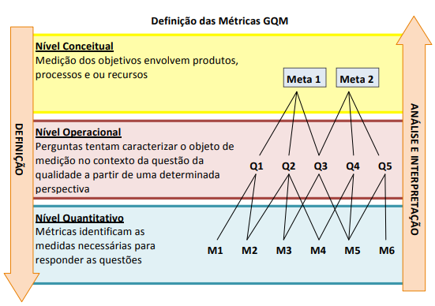
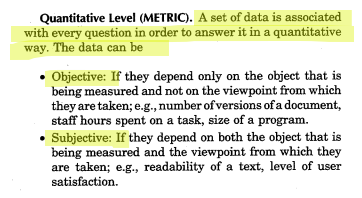
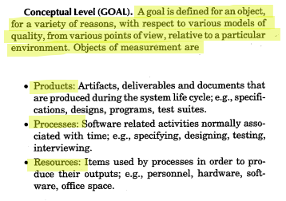
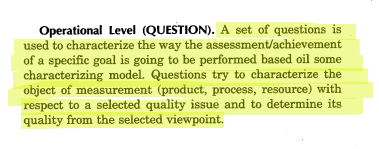

---

hide:

  - navigation
  - toc

---

# Especificação da Avaliação

## 🧭 Sumário
- [Metodologia GQM (Goal Question Metric)](#metodologia-gqm-goal-question-metric)
- [Objetivo (Goal)](#objetivo-goal)
- [Escopo da Avaliação](#escopo-da-avaliação)
- [Questões (Questions)](#questões-questions)
  - [Adequação Funcional](#adequação-funcional)
  - [Portabilidade](#portabilidade)
- [Métricas (Metrics)](#métricas-metrics)
  - [Adequação Funcional](#adequação-funcional-1)
  - [Portabilidade](#portabilidade-1)
- [Histórico de Versões](#histórico-de-versões)
- [Referências](#referências)

## Metodologia **GQM (Goal Question Metric)**

Para a realização da etapa de especificação da avaliação utilizaremos a metodologia GQM.

> GQM é uma abordagem de cima para baixo (top-down) para estabelecer um sistema de medição direcionado a metas para o desenvolvimento de software, em que a equipe começa com metas organizacionais, define a medição das metas, levanta questões a abordar os objetivos e identifica as métricas que proporcionem respostas às perguntas.
>
> (SILVA et al., 2009, p. 4)

  <strong>Figura 1 – Definição das Métricas GQM</strong>
   
  
   
  <em>Fonte: Silva et al. (2009, p. 4).</em>

 
 

>Cada questão é associada a métricas que permitem responder de maneira quantitativa e verificável.
>Os dados coletados podem ser:
>- Objetivos: dependem apenas do objeto medido, como número de versões de um artefato, esforço (em horas) despendido em uma tarefa ou tamanho de um módulo de código;
>- Subjetivos: dependem tanto do objeto quanto da percepção do avaliador, como legibilidade de um documento, clareza de uma interface ou nível de satisfação do usuário.
>
>(BASILI et al., 1994, p. 529)

  <strong>Figura 2 – Descrição das Métricas</strong>
   
  
   
  <em>Fonte: Basili et al. (1994, p. 529).</em>

---

Analisar o software Cal.com, uma plataforma de agendamento open source e auto-hospedável, com o propósito de avaliar sua qualidade quanto às características de Adequação Funcional e Portabilidade, de acordo com o modelo de qualidade ISO/IEC 25010.

A avaliação busca verificar o grau de completude e correção das funcionalidades essenciais de agendamento, bem como a capacidade da aplicação de operar e ser implantada em diferentes ambientes.

A análise é conduzida do ponto de vista dos usuários finais e avaliadores técnicos, considerando o contexto de uso real do sistema, que inclui a integração com calendários externos (como Google Calendar e Outlook), a execução multiplataforma (Linux, Windows e macOS) e o suporte a implantação via self-hosting documentada pela equipe do Cal.com.

---

## Escopo da Avaliação

| **Elemento** | **Descrição** |
| :------------ | :------------- |
| **O que será avaliado** | O sistema **Cal.com** (versão open source estável disponível no GitHub até outubro de 2025), com foco nos módulos de **agendamento de eventos**, **integração com calendários externos** (Google Calendar, Outlook) e **envio de notificações**. |
| **O que não será avaliado** | Aspectos relacionados à **segurança da informação**, **desempenho do sistema** e **usabilidade da interface**, que serão abordados em etapas futuras do projeto. |
| **Ambiente de teste e condições** | Testes realizados em ambiente controlado, com os seguintes parâmetros: • **Sistemas Operacionais:** Ubuntu 22.04, Windows 11 e macOS Sonoma • **Navegadores:** Google Chrome, Mozilla Firefox e Safari • **Dispositivos:** Desktop e notebook • **Conexão:** Internet banda larga estável |
| **Responsáveis e papéis** | • **Equipe de Avaliação:** autores do projeto (Antonio Carvalho, Gustavo Haubert, Atyrson Souto, Vinicius Alves, Cairo Florenço e Pedro Henrique Braga de Morais) • **Orientação e supervisão:** Profa. **Cristiane Soares Ramos** • **Responsáveis pela coleta e interpretação de métricas:** Equipe de desenvolvimento e avaliadores de qualidade |

---

### Objetivos (Goals)

>Neste nível, um objetivo é feito para um determinado objeto de medição, podendo ser analisado sob diferentes perspectivas:
>- Produtos: artefatos e entregáveis gerados ao longo do ciclo de vida do sistema, como especificações, diagramas, código-fonte e casos de teste;
>- Processos: atividades relacionadas ao desenvolvimento de software, como modelagem, codificação, testes e entrevistas;
>- Recursos: elementos utilizados na execução dos processos, como equipe, hardware, software e infraestrutura de apoio.
>
>(BASILI et al., 1994, p. 528)

  <strong>Figura 3 – Descrição das Métricas</strong>
   
  
   
  <em>Fonte: Basili et al. (1994, p. 528).</em>

---

## 1° Objetivo de Medição: Adequação Funcional

| Elemento | Descrição |
| :-- | :-- |
| Analisar | o software Cal.com |
| Com propósito de | avaliar sua qualidade funcional |
| A respeito de | Adequação Funcional |
| Do ponto de vista de | usuários do sistema |
| No contexto de | avaliação da qualidade de software segundo o modelo ISO/IEC 25010 |

**Tabela 1 – 1° Objetivo de Medição: Adequação Funcional**

---

### Questões (Q)

>Nesse estágio, um conjunto de questões orienta a forma de avaliação do objetivo definido, descrevendo como e em que medida o objeto será examinado segundo um modelo de qualidade.
>Essas perguntas buscam caracterizar o produto, processo ou recurso em relação a aspectos específicos da qualidade, permitindo compreender seu desempenho sob o ponto de vista selecionado.
>
>(BASILI et al., 1994, p. 528)

  <strong>Figura 4 – Descrição das Questões</strong>
   
  
   
  <em>Fonte: Basili et al. (1994, p. 528).</em>

---

#### Q1 – Funcionalidades Principais
As funcionalidades principais do sistema (agendamento, notificação e integração com Google Calendar e Outlook) estão implementadas conforme o esperado para um software de agendamento?

- **Hipót. H1.1:** O Cal.com implementa a maioria das funcionalidades essenciais, atendendo aos requisitos esperados para um sistema de agendamento.

---

#### Q2 – Correção de Operação
As funções centrais de agendamento (criação, edição, cancelamento e reagendamento) funcionam corretamente e de forma previsível?

- **Hipót. H2.1:** As funcionalidades principais operam corretamente na maioria dos cenários, com falhas menores não críticas.

---

#### Q3 – Completude Funcional
Existem funcionalidades redundantes ou ausentes?

- **Hipót. H3.1:** O sistema possui as funcionalidades adequadas para seu propósito, com eventuais ausências secundárias.

---

#### Q4 – Impacto das Funcionalidades Ausentes
Qual o nível de impacto de funcionalidades ausentes ou redundantes para o uso do sistema?

- **Hipót. H4.1:** A ausência de funções secundárias pode impactar usuários avançados, mas não compromete o fluxo principal.

---

#### Q5 – Consistência Entre Navegadores
Qual o nível de consistência do uso do software entre diferentes navegadores e sessões?

- **Hipót. H5.1:** O sistema mantém comportamento consistente, garantindo respostas previsíveis e uniformes na maioria dos cenários de uso.

---

### Métricas Relacionadas

| **Código** | **Métrica** | **Tipo** | **Descrição** | **Critério de Julgamento** |
|:--:|:--|:--|:--|:--|
| **M1** | Cobertura funcional esperada | Quantitativa | Verificar quantas funcionalidades essenciais (agendar, reagendar, cancelar, integrar, notificar) estão implementadas e acessíveis. **Fórmula:** (Nº funcionalidades implementadas ÷ Nº esperadas) × 100 | ≥ 90% = Excelente  70–89% = Regular  <70% = Insatisfatória |
| **M2** | Taxa de sucesso em execução de funcionalidades principais | Quantitativa | Executar cada funcionalidade principal ao menos 3 vezes e calcular. **Fórmula:** (Execuções bem-sucedidas ÷ Total de execuções) × 100 | ≥ 95% = Excelente  85–94% = Boa  <85% = Insatisfatória |
| **M3** | Taxa de sucesso dos fluxos de agendamento | Quantitativa | Realizar 5 testes completos (criar, editar, reagendar, cancelar). **Fórmula:** (Fluxos bem-sucedidos ÷ Total de testes) × 100 | 100% = Excelente  90–99% = Regular  <90% = Insatisfatória |
| **M4** | Ocorrência de erros visíveis durante o agendamento | Quantitativa | Contar mensagens de erro, falhas na interface ou inconsistências em cada teste funcional. | 0–2 = Excelente  3–5 = Regular  >5 = Insatisfatória |
| **M5** | Percentual de funcionalidades esperadas ausentes | Quantitativa | Identificar funcionalidades essenciais em outras aplicações de agendamento mas não encontradas na aplicação. **Fórmula:** (Ausentes ÷ Esperadas) × 100 | ≤ 5% = Excelente  6–15% = Regular  >15% = Insatisfatória |
| **M6** | Número de funcionalidades redundantes identificadas | Quantitativa | Contar funções que duplicam propósitos (ex.: dois modos diferentes de cancelar o mesmo evento). | 0–1 = Excelente  2–3 = Regular  >3 = Insatisfatória |
| **M7** | Avaliação de impacto percebido pelos avaliadores | Qualitativa | Atribuir notas de 1 (sem impacto) a 5 (muito impacto) para cada função ausente ou redundante e calcular a média. | ≤ 2 = Excelente  3 = Regular  >3 = Insatisfatória |
| **M8** | Compatibilidade entre navegadores | Quantitativa | Executar fluxos idênticos (criar, cancelar, reagendar) em Chrome, Firefox e Safari. **Fórmula:** (Fluxos sem erro ÷ Total de fluxos testados) × 100 | ≥ 95% = Excelente  80–94% = Boa  <80% = Insatisfatória |

## 2° Objetivo de Medição: Portabilidade

| Elemento | Descrição |
| :-- | :-- |
| **Analisar** | o software **Cal.com** |
| **Para o propósito de** | avaliar sua qualidade quanto à capacidade de ser instalado, executado e utilizado em diferentes ambientes |
| **Com respeito a** | **Portabilidade** |
| **Do ponto de vista de** | **usuários e avaliadores técnicos** |
| **No contexto de** | **avaliação da qualidade de software segundo o modelo ISO/IEC 25010** |

**Tabela 2 – 2° Objetivo de Medição: Portabilidade**

---

#### Q1 – Documentação de Self-Hosting
O processo de *self-hosting* (auto-hospedagem) do Cal.com é bem documentado e pode ser executado com sucesso em diferentes ambientes de servidor?

- **Hipót. H1.1:** A documentação oficial fornece um guia claro para implantação, permitindo que usuários com conhecimento técnico moderado realizem o *self-hosting* com sucesso.

---

#### Q2 – Consistência Entre Navegadores
A aplicação web do Cal.com mantém sua funcionalidade e aparência consistentes quando acessada a partir de diferentes navegadores?

- **Hipót. H2.1:** A aplicação é totalmente funcional e consistente nos principais navegadores, com variações visuais mínimas que não afetam a usabilidade.

---

#### Q3 – Esforço de Implantação
O esforço necessário para configurar e implantar uma instância própria do Cal.com é considerado baixo?

- **Hipót. H3.1:** O esforço de implantação é baixo em ambientes baseados em Docker, mas moderado em configurações que exigem gerenciamento manual de dependências.

---

#### Q4 – Dependências de Infraestrutura
As dependências de infraestrutura necessárias para a implantação estão claramente especificadas e são de fácil gerenciamento?

- **Hipót. H4.1:** As dependências críticas estão bem documentadas, mas a configuração de serviços externos (como provedores de e-mail) pode exigir esforço adicional.

---

#### Q5 – Compatibilidade Entre Dispositivos
A interface e as funcionalidades do Cal.com permanecem acessíveis e utilizáveis em diferentes dispositivos?

- **Hipót. H5.1:** O design responsivo da aplicação mantém todas as principais funcionalidades operacionais e legíveis em qualquer dispositivo, sem perda significativa de usabilidade.

---

### Métricas Relacionadas

| **Código** | **Métrica** | **Tipo** | **Descrição** | **Critério de Julgamento** |
|:--:|:--|:--|:--|:--|
| **M9** | Taxa de sucesso de instalação em múltiplos ambientes | Quantitativa | Verificar, com base na documentação, se o processo de instalação pode ser realizado em diferentes sistemas.  **Fórmula:** (Instalações bem documentadas ÷ Total de ambientes descritos) × 100 | ≥ 90% = Excelente  70–89% = Regular  <70% = Insatisfatória |
| **M10** | Tempo médio estimado de implantação | Quantitativa | Estimar o tempo total descrito na documentação para preparar o ambiente e executar o sistema até o funcionamento pleno.  **Fórmula:** (∑ tempos estimados ÷ nº de ambientes) | ≤ 30 min = Excelente  31–60 = Regular  >60 = Precisa de otimização |
| **M11** | Qualidade percebida da documentação de instalação | Qualitativa | Avaliar (escala 1–5) a clareza, completude e precisão da documentação. Média das notas dos avaliadores. | ≥ 4,5 = Excelente  3–4,4 = Boa   < 3 = Fraca |
| **M12** | Esforço de implantação percebido pela equipe | Qualitativa | Avaliação (escala 1–5) do esforço cognitivo e técnico necessário para compreender e seguir a documentação de instalação. | ≤ 2 = Excelente (fácil)  3 = Moderado  ≥ 4 = Difícil |
| **M13** | Compatibilidade entre navegadores | Quantitativa | Executar os mesmos fluxos principais (criar, reagendar, cancelar) em diferentes navegadores.  **Fórmula:** (Fluxos sem erro ÷ Total testados) × 100 | ≥ 95% = Excelente  80–94% = Boa  <80% = Ruim |
| **M14** | Compatibilidade de execução em diferentes dispositivos | Quantitativa | Verificar se as funcionalidades principais permanecem utilizáveis e a interface se mantém legível em desktop, tablet e smartphone.  **Fórmula:** (Dispositivos com funcionamento completo ÷ Total de dispositivos testados) × 100 | 100% = Excelente  ≥ 80% = Boa  <80% = Insatisfatória |

---

## Histórico de Versões

| Versão | Data       | Descrição                                                               | Autor                               |
| :----- | :--------- | :---------------------------------------------------------------------- | :---------------------------------- |
| `1.0`  | 12/10/2025 | Criação da estrutura inicial da página e criação das questões e métricas da adequação funcional | [Gustavo Haubert](https://github.com/GustavoHaubert) |
| `1.1`  | 12/10/2025 | Criação das questões e métricas de portabilidade | [Atyrson Souto](https://github.com/Atyrson) |
| `1.2`  | 12/10/2025 | Criação dos Objetivos | [Vinicius Alves](https://github.com/vinialves2020) |
| `1.3`  | 12/10/2025 | Adicionando tópico sobre a metodologia | [Cairo Florenço](https://github.com/CA1RO) |
| `1.4`  | 12/10/2025 | Adicionando tabela de escopo | [Antonio Carvalho](https://github.com/antonioscarvalho) |
| `1.5` | 20/10/2025 | Reformula o Objetivo da avaliação de acordo com a GQM após feedback da professora | [Pedro Braga](https://github.com/Stain19) |
| `1.6` | 20/10/2025 | Adiciona hipóteses para cada pergunta de adequação funcional e portabilidade, além de reformular as perguntas de portabilidade | [Pedro Braga](https://github.com/Stain19) |
| `1.7` | 21/10/2025 | Refina as métricas de portabilidade, desmembrando a métrica M8 para melhor adequação às questões | [Atyrson Souto](https://github.com/Atyrson) |
| `1.8`  | 21/10/2025 | Ajuste nas questões de adequação funcional e suas métricas  | [Gustavo Haubert](https://github.com/GustavoHaubert) |
| `1.9`  | 21/10/2025 | Adiciona novas métricas de portabilidade e adiciona critérios de julgamento nas duas tabelas  | [Cairo Florenço](https://github.com/CA1RO) |
| `2.0`  | 23/10/2025 | Padronização de artefatos e tabelas de acordo com estruturação hierárquica de objetivo, questões e métricas, juntamente da adição de novos conceitos e suas respectivas referências | [Antonio Carvalho](https://github.com/antonioscarvalho) |

## Referências

SILVA, Carlos Vinícius Pereira da; MOURA, Déborah Carvalho de; CAMPOS, Danylo de Castro; NERY, Paulo. *GQM: Goal - Question - Metric*. 2009.

CAL.COM. *About Cal.com, Inc. Connecting a billion people by 2031*. Disponível em: https://cal.com/about. Acesso em: 23 out. 2025.

BASILI, Victor R.; CALDIERA, Gianluigi; ROMBACH, H. Dieter. *Goal Question Metric Paradigm*. In: MARCINIAK, John J. (Ed.). Encyclopedia of Software Engineering - 2° Vol. New York: John Wiley & Sons, Inc., 1994. P. 528, 529. 
