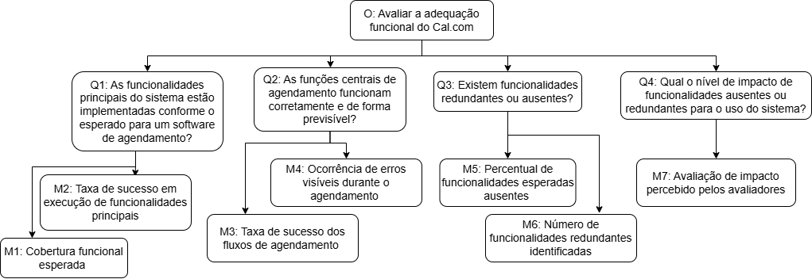

---
hide:
  - toc
---
# Adequação Funcional

## Objetivo de Medição

| Elemento | Descrição |
| :-- | :-- |
| Analisar | o software Cal.com |
| Com propósito de | avaliar sua qualidade funcional |
| A respeito de | Adequação Funcional |
| Do ponto de vista de | usuários do sistema |
| No contexto de | avaliação da qualidade de software segundo o modelo ISO/IEC 25010 |

  <em>Tabela 1 - Objetivo de Medição. (Adequação Funcional)</em>

---
## Questões

#### Q1 – Funcionalidades Principais
As funcionalidades principais do sistema (agendamento, notificação e integração com Google Calendar e Outlook) estão implementadas conforme o esperado para um software de agendamento?

- **Hipót. H1.1:** O Cal.com implementa a maioria das funcionalidades essenciais, atendendo aos requisitos esperados para um sistema de agendamento.

---

#### Q2 – Correção de Operação
As funções centrais de agendamento (criação, edição, cancelamento e reagendamento) funcionam corretamente e de forma previsível?

- **Hipót. H2.1:** As funcionalidades principais operam corretamente na maioria dos cenários, com falhas menores não críticas.

---

#### Q3 – Completude Funcional
Existem funcionalidades redundantes ou ausentes?

- **Hipót. H3.1:** O sistema possui as funcionalidades adequadas para seu propósito, com eventuais ausências secundárias.

---

#### Q4 – Impacto das Funcionalidades Ausentes
Qual o nível de impacto de funcionalidades ausentes ou redundantes para o uso do sistema?

- **Hipót. H4.1:** A ausência de funções secundárias pode impactar usuários avançados, mas não compromete o fluxo principal.

---

## Métricas Relacionadas

| **Código** | **Métrica** | **Tipo** | **Descrição** | **Critério de Julgamento** |
|:--:|:--|:--|:--|:--|
| **M1** | Cobertura funcional esperada | Quantitativa | Verificar quantas funcionalidades essenciais (agendar, reagendar, cancelar, integrar, notificar) estão implementadas e acessíveis. **Fórmula:** (Nº funcionalidades implementadas ÷ Nº esperadas) × 100 | **≥ 90% = Excelente** – Todas ou quase todas as funções essenciais estão disponíveis e operacionais.  **70–89% = Regular** – Algumas funções secundárias ausentes, mas o núcleo funcional está presente.  **<70% = Insatisfatória** – Ausência de funções principais compromete o uso do sistema. |
| **M2** | Taxa de sucesso em execução de funcionalidades principais | Quantitativa | Executar cada funcionalidade principal ao menos 3 vezes e calcular. **Fórmula:** (Execuções bem-sucedidas ÷ Total de execuções) × 100 | **≥ 95% = Excelente** – As funções principais operam de forma consistente e previsível.  **85–94% = Boa** – Ocorrência de pequenas falhas esporádicas sem impacto crítico.  **<85% = Insatisfatória** – Erros frequentes comprometem o uso confiável das funções. |
| **M3** | Taxa de sucesso dos fluxos de agendamento | Quantitativa | Realizar 5 testes completos (criar, editar, reagendar, cancelar). **Fórmula:** (Fluxos bem-sucedidos ÷ Total de testes) × 100 | **100% = Excelente** – Todos os fluxos funcionam conforme esperado, sem falhas.  **90–99% = Regular** – Pequenos desvios ocasionais, mas o processo é funcional.  **<90% = Insatisfatória** – Falhas frequentes impedem o fluxo completo de agendamento. |
| **M4** | Ocorrência de erros visíveis durante o agendamento | Quantitativa | Contar mensagens de erro, falhas na interface ou inconsistências em cada teste funcional. | **0–2 = Excelente** – Interface estável, com raros erros visíveis.  **3–5 = Regular** – Alguns erros não críticos, mas sem prejuízo grave ao uso.  **>5 = Insatisfatória** – Erros recorrentes ou graves que prejudicam o agendamento. |
| **M5** | Percentual de funcionalidades esperadas ausentes | Quantitativa | Identificar funcionalidades essenciais em outras aplicações de agendamento mas não encontradas na aplicação. **Fórmula:** (Ausentes ÷ Esperadas) × 100 | **≤ 5% = Excelente** – Todas as funções principais estão presentes, sem lacunas significativas.  **6–15% = Regular** – Algumas funções ausentes, mas o sistema continua utilizável.  **>15% = Insatisfatória** – Ausências importantes limitam a funcionalidade do sistema. |
| **M6** | Número de funcionalidades redundantes identificadas | Quantitativa | Contar funções que duplicam propósitos (ex.: dois modos diferentes de cancelar o mesmo evento). | **0–1 = Excelente** – Design funcional limpo e sem redundâncias.  **2–3 = Regular** – Algumas duplicidades toleráveis, sem prejuízo à clareza do sistema.  **>3 = Insatisfatória** – Redundâncias causam confusão e dificultam o uso. |
| **M7** | Avaliação de impacto percebido pelos avaliadores | Qualitativa | Atribuir notas de 1 (sem impacto) a 5 (muito impacto) para cada função ausente ou redundante e calcular a média. | **≤ 2 = Excelente** – Ausências ou redundâncias não afetam a experiência do usuário.  **3 = Regular** – Impacto perceptível, mas de baixa criticidade.  **>3 = Insatisfatória** – Impacto significativo que compromete a usabilidade ou completude funcional. |

  <em>Tabela 2 - Metricas Relacionadas. (Adequação Funcional)</em>

---

### Diagrama 

  <em>Figura 1 - Representação visual do GQM de Adequação Funcional.</em>
  <em>Autor: Cairo Florenço.</em>

>Legenda: O: Objetivo, Q: Questão e M: Métrica relacionada.