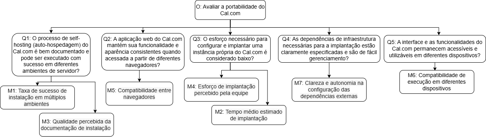

---
hide:
  - toc
---

# Portabilidade

## Objetivo de Medição

| Elemento | Descrição |
| :-- | :-- |
| **Analisar** | o software **Cal.com** |
| **Para o propósito de** | avaliar sua qualidade quanto à capacidade de ser instalado, executado e utilizado em diferentes ambientes |
| **Com respeito a** | **Portabilidade** |
| **Do ponto de vista de** | **usuários e avaliadores técnicos** |
| **No contexto de** | **avaliação da qualidade de software segundo o modelo ISO/IEC 25010** |

  <em>Tabela 1 – Objetivo de Medição (Portabilidade)</em>

---

## Questões

#### Q1 – Documentação de Self-Hosting
O processo de *self-hosting* (auto-hospedagem) do Cal.com é bem documentado e pode ser executado com sucesso em diferentes ambientes de servidor?

- **Hipót. H1.1:** A documentação oficial fornece um guia claro para implantação, permitindo que usuários com conhecimento técnico moderado realizem o *self-hosting* com sucesso.

---

#### Q2 – Consistência Entre Navegadores
A aplicação web do Cal.com mantém sua funcionalidade e aparência consistentes quando acessada a partir de diferentes navegadores?

- **Hipót. H2.1:** A aplicação é totalmente funcional e consistente nos principais navegadores, com variações visuais mínimas que não afetam a usabilidade.

---

#### Q3 – Esforço de Implantação
O esforço necessário para configurar e implantar uma instância própria do Cal.com é considerado baixo?

- **Hipót. H3.1:** O esforço de implantação é baixo em ambientes baseados em Docker, mas moderado em configurações que exigem gerenciamento manual de dependências.

---

#### Q4 – Dependências de Infraestrutura
As dependências de infraestrutura necessárias para a implantação estão claramente especificadas e são de fácil gerenciamento?

- **Hipót. H4.1:** As dependências críticas estão bem documentadas, mas a configuração de serviços externos (como provedores de e-mail) pode exigir esforço adicional.

---

#### Q5 – Compatibilidade Entre Dispositivos
A interface e as funcionalidades do Cal.com permanecem acessíveis e utilizáveis em diferentes dispositivos?

- **Hipót. H5.1:** O design responsivo da aplicação mantém todas as principais funcionalidades operacionais e legíveis em qualquer dispositivo, sem perda significativa de usabilidade.

---

## Métricas Relacionadas

| **Código** | **Métrica** | **Tipo** | **Descrição** | **Critério de Julgamento** |
|:--:|:--|:--|:--|:--|
| **M1** | Taxa de sucesso de instalação em múltiplos ambientes | Quantitativa | Verificar, com base na documentação, se o processo de instalação pode ser realizado em diferentes sistemas.  **Fórmula:** (Instalações bem documentadas ÷ Total de ambientes descritos) × 100 | **≥ 90% = Excelente** – Instalação reproduzível e sem erros na maioria dos ambientes testados.  **70–89% = Regular** – Instalação possível com pequenos ajustes em alguns ambientes.  **<70% = Insatisfatória** – Falhas recorrentes ou falta de clareza impedem a instalação completa. |
| **M2** | Tempo médio estimado de implantação | Quantitativa | Estimar o tempo total descrito na documentação para preparar o ambiente e executar o sistema até o funcionamento pleno.  **Fórmula:** (∑ tempos estimados ÷ nº de ambientes) | **≤ 30 min = Excelente** – Implantação rápida e bem automatizada.  **31–60 min = Regular** – Tempo aceitável, mas com etapas manuais perceptíveis.  **>60 min = Precisa de otimização** – Processo difícil ou com dependências excessivas. |
| **M3** | Qualidade percebida da documentação de instalação | Qualitativa | Avaliar (escala 1–5) a clareza, completude e precisão da documentação. Média das notas dos avaliadores. | **≥ 4,5 = Excelente** – Documentação clara, completa e autossuficiente.  **3–4,4 = Boa** – Documentação adequada, mas com lacunas ou ambiguidades pontuais.  **<3 = Fraca** – Falta de clareza ou informações essenciais prejudicam o uso. |
| **M4** | Esforço de implantação percebido pela equipe | Qualitativa | Avaliação (escala 1–5) do esforço cognitivo e técnico necessário para compreender e seguir a documentação de instalação. | **≤ 2 = Excelente** – Instalação intuitiva, requer pouco conhecimento prévio.   **3 = Moderado** – Requer atenção e leitura detalhada, mas é realizável.  **≥ 4 = Difícil** – Processo complexo ou confuso, demanda suporte técnico. |
| **M5** | Compatibilidade entre navegadores | Quantitativa | Executar os mesmos fluxos principais (criar, reagendar, cancelar) em diferentes navegadores.  **Fórmula:** (Fluxos sem erro ÷ Total testados) × 100 | **≥ 95% = Excelente** – Experiência idêntica e livre de erros nos principais navegadores.  **80–94% = Boa** – Pequenas diferenças visuais ou de desempenho sem impacto funcional.  **<80% = Ruim** – Falhas ou inconsistências comprometem a usabilidade. |
| **M6** | Compatibilidade de execução em diferentes dispositivos | Quantitativa | Verificar se as funcionalidades principais permanecem utilizáveis e a interface se mantém legível em desktop, tablet e smartphone.  **Fórmula:** (Dispositivos com funcionamento completo ÷ Total de dispositivos testados) × 100 | **100% = Excelente** – Total responsividade e funcionamento completo em todos os dispositivos.  **≥ 80% = Boa** – Funciona adequadamente, com pequenas perdas de layout ou interação.  **<80% = Insatisfatória** – Funções ou elementos se tornam inutilizáveis em alguns dispositivos. |
| **M7** | Clareza e autonomia na configuração das dependências externas | Qualitativa | Avaliar o quão bem as dependências críticas (banco de dados, serviços de e-mail, APIs externas, etc.) estão documentadas e se sua configuração pode ser realizada sem suporte técnico especializado. Atribuir nota de 1 a 5 com base em critérios de clareza, completude e autonomia. | **≥ 4,5 = Excelente** – Dependências bem explicadas, configuração autônoma e direta.  **3–4,4 = Boa** – Documentação adequada, mas requer atenção ou ajustes manuais.  **<3 = Fraca** – Instruções insuficientes ou dependências difíceis de configurar. |

  <em>Tabela 2 - Metricas Relacionadas. (Portabilidade)</em>

---

### Diagrama 

  <em>Figura 1 - Representação visual do GQM de Portabilidade.</em>
  <em>Autor: Cairo Florenço.</em>

>Legenda: O: Objetivo, Q: Questão e M: Métrica relacionada.