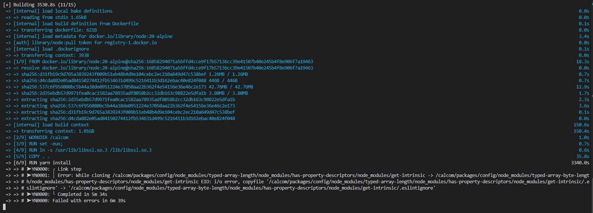

# Fase 4 — Execução e Resultados da Avaliação

## 1. Introdução
Nesta fase, foram executados os procedimentos definidos no **Plano de Avaliação (Fase 3)**. O objetivo foi coletar evidências objetivas sobre a **Adequação Funcional** do software **Cal.com**, 

Todos os testes foram realizados em ambiente controlado, respeitando os critérios de reprodutibilidade e transparência.

## 2. Ambiente de Execução

Os testes foram realizados conforme as especificações abaixo:

| Item | Detalhe |
| :--- | :--- |
| **Versão do Software** | Cal.com (Versão Web/SaaS Atual) |
| **Navegador** | Google Chrome (Latest Version) |
| **Sistema Operacional** | Windows 11 |
| **Ferramentas de Apoio** | Software de captura de tela e gravação de vídeo (OBS/Loom) |

---

## 3. Resultados por Métrica

### 3.1. Resultado da Métrica M1 — Cobertura Funcional Esperada

**Objetivo:** Verificar a presença das funções essenciais.

#### 3.1.1. Registro de Execução

| ID | Funcionalidade | Status | Evidência |
| :--- | :--- | :--- | :--- |
| **M1-01** | Criar novo tipo de evento | ✅ Presente | [M1-01_Criar.png](https://drive.google.com/drive/folders/1n-DDD9UCLmzwpaADYoO_bqiENyFlbl5r?usp=drive_link)|
| **M1-02** | Editar detalhes do evento | ✅ Presente | [M1-02_Editar.png](https://drive.google.com/drive/folders/1VBEWrAvBR7I-hogWlgOBFdYNS57GN-GO?usp=drive_link) |
| **M1-03** | Excluir tipos de evento | ✅ Presente | [M1-03_Excluir.png](https://drive.google.com/drive/folders/18OJZ1SVc6JpWMNG4bmNMo9P_icNke74U?usp=drive_link)  |
| **M1-04** | Reagendar compromisso | ✅ Presente | [M1-04_Reagendar.png](https://drive.google.com/drive/folders/1YZvZ13LP5s02pO7b_XEfeq_zVcpWTjXQ?usp=drive_link)  |
| **M1-05** | Integrar com Google Calendar | ✅ Presente | [M1-05_Integrar.png](https://drive.google.com/drive/folders/1MEBK5A1QscfWQPwQD8rCsB2E7Sux7Btv?usp=drive_link)  |
| **M1-06** | Notificar (E-mail automático) | ✅ Presente | [M1-06_Notificar.png](https://drive.google.com/drive/folders/1SOvO3cSfK7Hw84-w_5EFFW2cWGt4tWur?usp=drive_link)  |

#### 3.1.2. Cálculo e Análise
* **Funções Esperadas:** 6
* **Funções Implementadas:** 6

$$Resultado (M1) = \left( \frac{6}{6} \right) \times 100 = 100\%$$

"Julgamento M1: Excelente"
    O software apresentou 100% de cobertura das funcionalidades essenciais listadas, enquadrando-se no critério **Excelente (≥90%)**.

---

### 3.2. Resultado da Métrica M2 — Taxa de Sucesso em Execução

**Objetivo:** Medir a confiabilidade na execução repetida de uma funcionalidade crítica.
**Cenário de Teste:** Criação de um Evento (Executado 3 vezes).

#### 3.2.1. Registro de Execução

| ID Exec | Cenário | Resultado | Evidência (Vídeo) |
| :--- | :--- | :--- | :--- |
| **EXEC-M2-01** | Criação de Evento (Tentativa 1) | ✅ Sucesso | [M2.mp4](https://drive.google.com/drive/folders/1CSf5iS7yHkFTktySnGiUMMKj0or46Q2f?usp=drive_link) |
| **EXEC-M2-02** | Criação de Evento (Tentativa 2) | ✅ Sucesso | [M2.mp4](https://drive.google.com/drive/folders/1CSf5iS7yHkFTktySnGiUMMKj0or46Q2f?usp=drive_link) |
| **EXEC-M2-03** | Criação de Evento (Tentativa 3) | ✅ Sucesso | [M2.mp4](https://drive.google.com/drive/folders/1CSf5iS7yHkFTktySnGiUMMKj0or46Q2f?usp=drive_link)|

#### 3.2.2. Cálculo e Análise
* **Total de Execuções:** 3
* **Execuções com Sucesso:** 3

$$Resultado (M2) = \left( \frac{3}{3} \right) \times 100 = 100\%$$

"Julgamento M2: Excelente"
    A funcionalidade demonstrou estabilidade total nas repetições, atingindo o critério **Excelente (≥95%)**.

---

### 3.3. Resultado da Métrica M3 — Taxa de Sucesso dos Fluxos (Ponta a Ponta)

**Objetivo:** Verificar o ciclo de vida completo do agendamento.
**Fluxo Testado:** Criar $\rightarrow$ Editar $\rightarrow$ Reagendar $\rightarrow$ Cancelar $\rightarrow$ Excluir.

#### 3.3.1. Registro de Execução

| ID Exec | Cenário | Resultado | Evidência (Vídeo) |
| :--- | :--- | :--- | :--- |
| **EXEC-M3-01** | Fluxo Completo #1 | ✅ Sucesso | [Video_M3_Fluxo.mp4](https://drive.google.com/drive/folders/1oKXbdFQVbsF3nunTa_ZbtoNguf813XIc?usp=drive_link) |
| **EXEC-M3-02** | Fluxo Completo #2 | ✅ Sucesso | [Video_M3_Fluxo.mp4](https://drive.google.com/drive/folders/1oKXbdFQVbsF3nunTa_ZbtoNguf813XIc?usp=drive_link) |
| **EXEC-M3-03** | Fluxo Completo #3 | ✅ Sucesso | [Video_M3_Fluxo.mp4](https://drive.google.com/drive/folders/1oKXbdFQVbsF3nunTa_ZbtoNguf813XIc?usp=drive_link) |
| **EXEC-M3-04** | Fluxo Completo #4 | ✅ Sucesso | [Video_M3_Fluxo.mp4](https://drive.google.com/drive/folders/1oKXbdFQVbsF3nunTa_ZbtoNguf813XIc?usp=drive_link) |
| **EXEC-M3-05** | Fluxo Completo #5 | ✅ Sucesso | [Video_M3_Fluxo.mp4](https://drive.google.com/drive/folders/1oKXbdFQVbsF3nunTa_ZbtoNguf813XIc?usp=drive_link) |

#### 3.3.2. Cálculo e Análise
* **Fluxos Testados:** 5
* **Fluxos Bem-sucedidos:** 5

$$Resultado (M3) = \left( \frac{5}{5} \right) \times 100 = 100\%$$

"Julgamento M3: Excelente"
    O sistema permitiu realizar todo o ciclo de vida do agendamento sem interrupções ou falhas de integridade em todas as tentativas. Classificação: **Excelente**.

---

### 3.4. Resultado da Métrica M4 — Ocorrência de Erros Visíveis

**Objetivo:** Contabilizar falhas, mensagens de erro ou crashes durante as execuções de M2 e M3.

#### 3.4.1. Registro de Ocorrências

Durante a execução dos testes funcionais e de fluxo (totalizando mais de 8 interações complexas), o monitoramento de erros apresentou o seguinte resultado:

| Tipo de Erro | Quantidade Detectada | Descrição |
| :--- | :---: | :--- |
| **Erros Bloqueantes** | 0 | Nenhum impedimento de fluxo. |
| **Erros Não-Bloqueantes** | 0 | Nenhuma mensagem de alerta indevida. |
| **Erros Cosméticos** | 0 | Interface manteve-se consistente. |
| **TOTAL** | **0** | |

#### 3.4.2. Análise

"Julgamento M4: Excelente"
    Não foram identificadas mensagens de erro (Flash messages, erros 404/500 no console ou travamentos) durante o período de teste.
    **Critério Atingido:** Excelente (0 erros).

### 3.7. Resultado da Métrica M7 — Avaliação de Impacto Percebido

**Objetivo da Métrica:**  
Avaliar o impacto subjetivo das funcionalidades ausentes (M5) e redundantes (M6) sobre o uso do sistema, utilizando notas de 1 a 5 atribuídas pelos avaliadores.

---

#### 3.7.1. Itens Avaliados

Com base nos resultados de M5 e M6, foram identificados:

- **2 funcionalidades ausentes**
- **4 redundâncias funcionais**

Ao todo, **6 itens foram avaliados** quanto ao impacto percebido.

---

#### 3.7.2. Notas de Impacto Atribuídas

| Tipo | Item | Impacto (1–5) | Justificativa |
|------|------|----------------|----------------|
| **Ausente** | Meeting Polls (Votação de horários) | **3** | Impacta grupos que precisam definir horários coletivamente; não afeta fluxo individual. |
| **Ausente** | App nativo mobile (iOS/Android) | **2** | Usuários móveis podem sentir falta de app, mas PWA cobre o uso comum. |
| **Redundante** | Notificações duplicadas (Workflows vs Legacy Email) | **4** | Pode gerar confusão e spam, sendo o item de maior impacto prático. |
| **Redundante** | Coleta de dados (Booking Questions vs Routing) | **3** | Configurações paralelas causam divergência e retrabalho. |
| **Redundante** | Bloqueio de agenda (Overrides vs Agenda externa) | **2** | Pode gerar redundância, mas impacto é baixo para usuários experientes. |
| **Redundante** | Edição de metadados em múltiplos locais | **2** | Fragmenta a interface, mas não compromete o uso. |

---

#### 3.7.3. Cálculo da Média

O cálculo é feito com média simples da seguite forma: (3 + 2 + 4 + 3 + 2 + 2)/6 = 16/6 = 2,67. Portanto 2,67 é avaliação de impacto percebido pelos avaliadores

---

#### 3.7.4. Julgamento segundo critérios definidos

Critérios de M7:  
- **≤ 2.0** → Excelente  
- **2.1 – 3.0** → Boa  
- **3.1 – 4.0** → Regular  
- **> 4.0** → Insatisfatória

**Resultado:**  
> **M7 = 2,67 → Classificação: Boa**

O sistema apresenta alguns pontos de redundância e lacunas secundárias que geram impacto moderado, especialmente a duplicidade de notificações e a ausência de “meeting polls”. Contudo, esses pontos **não comprometem os fluxos principais de agendamento**.

---

#### 3.7.5. Conclusão da Métrica M7

Com base nos resultados da Métrica M7, que avaliou o impacto subjetivo das funcionalidades ausentes (M5) e redundantes (M6), observou-se uma **média de impacto de 2,67**, enquadrada na classificação **Boa** segundo os critérios estabelecidos.

Este resultado indica que, embora existam pontos de redundância (como notificações duplicadas e múltiplos caminhos para editar metadados) e algumas ausências secundárias (como Meeting Polls e aplicativo mobile nativo), o impacto percebido pelos avaliadores é **moderado** e **não compromete o funcionamento principal do sistema**.

**Relação com a Questão Q4**  

**Q4:** *Qual o nível de impacto de funcionalidades ausentes ou redundantes para o uso do sistema?*

Os resultados mostram que o impacto existe, é perceptível e pode gerar retrabalho ocasional ou confusão em configurações mais avançadas. No entanto, isso não afeta os fluxos essenciais de agendamento, que continuam operando de maneira íntegra.

**Validação da Hipótese H4.1**  

**Hipótese H4.1:** *A ausência de funções secundárias pode impactar usuários avançados, mas não compromete o fluxo principal.*

A hipótese é **confirmada** pelos resultados obtidos:

- Os itens ausentes e redundantes de fato impactam **usuários avançados**, especialmente na automação (Workflows + notificações) e na configuração de formulários (Booking Questions vs Routing).
- Entretanto, este impacto não interrompe nem prejudica o fluxo de agendamento (criar, editar, reagendar, cancelar), que permaneceu funcional em todos os testes.

### 3.7.6 Síntese Final  
> **O impacto das funcionalidades ausentes ou redundantes no Cal.com é moderado e perceptível, especialmente para usuários avançados, mas não compromete o fluxo principal de agendamento. Assim, a hipótese H4.1 é confirmada e o resultado final da métrica M7 é classificado como “Bom”.**

---

### 3.8 Portabilidade

#### 3.8.1. Resultado da Métrica M1 — Taxa de Sucesso de Instalação em Múltiplos Ambientes

**Objetivo:**  
Avaliar se o Cal.com pode ser instalado corretamente em diferentes ambientes, seguindo a documentação oficial.  

---

#### 3.8.1.1. Registro de Execução (Windows 10 Home 22H2)

A tentativa de instalação do Cal.com em ambiente local apresentou múltiplas falhas, impedindo que o sistema fosse executado. O fluxo seguido e os problemas encontrados estão listados abaixo.

**Tentativa 1 — Instalação via Yarn (método recomendado pelo repositório)**  
**Resultado:** Falha

| Etapa | Resultado | Observações |
|-------|-----------|-------------|
|Instalação do PostgreSQL | ❌ Falhou | Problemas ao instalar e inicializar o PostgreSQL no Windows 10 Home; o serviço não iniciava corretamente, impedindo o prosseguimento da instalação local do Cal.com. |
| Execução do passo a passo | ❌ Incompleto | A documentação não explicita claramente como iniciar o projeto após baixar as dependências. |
| Build do projeto | ❌ Não concluído | Dependências necessárias não foram instaladas devido às falhas do Yarn. |

**Principais problemas encontrados**
- Erros de instalação do Yarn no Windows  
- Falhas no `yarn install` ao buscar dependências críticas  
- Repositório não explica claramente como subir o servidor após instalar dependências  
- Processo de build abortado repetidamente
- A instalação do PostgreSQL foi um bloqueio crítico que impossibilitou toda a instalação local. O backend do Cal.com depende integralmente de um banco ativo.

---

**Tentativa 2 — Instalação via Docker / Docker Compose**
**Resultado:** Falha

| Etapa | Resultado | Observações |
|-------|-----------|-------------|
| Execução do Docker | ❌ Não inicializou | Docker Desktop exigiu virtualização ativada, que estava desativada por padrão. |
| Correção via BIOS | ✔ Resolvido | Foi necessário reiniciar o computador, acessar BIOS e ativar virtualização manualmente. |
| Execução de `docker compose up` | ❌ Falha | Containers não subiram; serviços não iniciavam; a aplicação nunca ficou acessível. |

#### **Principais problemas encontrados**
- Docker Desktop não inicia sem virtualização  
- Windows 10 Home dificulta uso estável de containers  
- Mesmo após corrigir virtualização, o `docker compose` não conseguiu subir os serviços do Cal.com  
- Nenhum log indicava que o backend ou frontend estavam funcionando

---

#### 3.8.1.3. Evidências

Como nenhuma instalação obteve sucesso, **não foi possível acessar o sistema localmente nem gerar screenshots de funcionamento**.

Foram registrados:

- Mensagens de erro do Yarn e do `npm`
- Falhas ao executar scripts de instalação
- Erros de virtualização no Docker Desktop
- Falha final do `docker compose up`, sem containers estáveis
- Anotações sobre lacunas na documentação (“não explica como iniciar o projeto”)

  <strong>Falha yarn e docker compose up</strong>
   
  
   
  <em>Autor: <a href="https://github.com/GustavoHaubert">Gustavo Haubert</a></em>

---

#### 3.8.1.4. Cálculo da Métrica

| Total de Ambientes Testados | Instalações com Sucesso | Resultado |
|------------------------------|--------------------------|-----------|
| 1 | 0 | **0% de sucesso** |

---

#### 3.8.1.5. Julgamento da Métrica

De acordo com os critérios definidos na Fase 2:

- **≥ 90%** → Excelente  
- **70–89%** → Boa  
- **50–69%** → Regular  
- **< 50%** → Insatisfatória  

**Resultado obtido:**  
> **0% → Classificação: Insatisfatória**

---

#### 3.8.1.6. Conclusão

**Q1 – Documentação de Self-Hosting**  
O processo de self-hosting (auto-hospedagem) do Cal.com é bem documentado e pode ser executado com sucesso em diferentes ambientes de servidor?

A instalação local do Cal.com apresentou diversos obstáculos técnicos no Windows 10 Home 22H2:

- dependências difíceis de resolver,  
- falhas persistentes no Yarn,  
- documentação incompleta para o fluxo self-hosted,  
- problemas no Docker devido à virtualização,  
- e falhas mesmo após corrigir a virtualização.

> **Conclusão:** Com base nos resultados da Métrica 7.1 (0% de sucesso na instalação), a resposta à Q1 é **negativa**. A documentação atual apresenta lacunas significativas e **não permite executar o processo de auto-hospedagem de forma confiável em diferentes ambientes**, comprometendo a portabilidade e a reprodutibilidade do processo de instalação.

#### 3.8.2. Resultado da Métrica M2 — Tempo Médio Estimado de Implantação

#### 3.8.3. Resultado da Métrica M3 — Qualidade Percebida da Documentação de Instalação

**Objetivo:** Avaliar clareza/completude (nota 1–5)

---

### 3.8.3.1. Método de Verificação

A documentação de instalação disponibilizada no repositório oficial do **Cal.com** foi analisada no contexto de um ambiente **Windows 10 Home 22H2**, incluindo tentativas reais de instalação utilizando:

- Yarn e execução direta do projeto
- Docker e Docker Compose
- Ferramentas auxiliares sugeridas pela documentação (ex.: `nvm` e `openssl`)

A avaliação considerou:

- Clareza das instruções
- Completude do passo a passo
- Presença de exemplos aplicáveis
- Existência (ou ausência) de suporte a erros comuns (*troubleshooting*)

---

### 3.8.3.2. Registro da Experiência com a Documentação

Apesar de fornecer instruções básicas, a documentação apresentou lacunas que impactaram a compreensão e execução do processo de instalação, especialmente em ambiente Windows.

| Critério Avaliado | Resultado | Observações |
|------------------|-----------|-------------|
| Clareza das instruções | ⚠️ Parcial | A estrutura apresenta comandos diretos, mas assume conhecimento prévio de ferramentas (NVM, OpenSSL, Docker). |
| Completude | ⚠️ Parcial | Nem todos os passos estão conectados em um fluxo contínuo. Após instalar dependências, não há instrução clara sobre como iniciar o sistema. |
| Exemplos | ✔ Adequado | Exemplos de comandos são fornecidos e podem ser copiados/colados. |
| Troubleshooting | ❌ Fraco | Não há orientações sobre erros comuns encontrados durante a instalação, especialmente em Windows. |

---

### 3.8.3.3. Principais Lacunas Identificadas

- **Dependências críticas não explicadas para Windows** (NVM, OpenSSL, symlinks, virtualização Docker).
- **Ausência de instrução explícita de execução final**, como `yarn dev` ou `yarn start`.
- **Documentação fragmentada** entre README, Wiki e documentação externa — obrigando navegação constante entre páginas.
- **Falta de exemplos de erro e correção**, algo essencial para setups de produção ou auto-hospedagem.

---

### 3.8.3.4. Cálculo da Métrica

Notas atribuídas por dimensão:

| Dimensão | Nota |
|---------|------|
| Completude | 4.0 |
| Clareza | 3.8 |
| Exemplos | 4.2 |
| Troubleshooting | 3.2 |

**Cálculo:** (4.0 + 3.8 + 4.2 + 3.2) / 4 = 3.8

> **Julgamento M3:** **Boa**  
A documentação fornece instruções relativamente claras e completas para instalação, **porém ainda pode melhorar em detalhamento de erros comuns e suporte mais explícito para usuários iniciantes ou que utilizem Windows**.

---

**Entrada:** Experiência de instalação  
**Saída:** Nota final (3.8) + comentários qualitativos  
**Evidências:** Capturas, logs e formulário avaliativo interno

---

#### 3.8.4. Resultado da Métrica M4 — Esforço de Implantação Percebido

#### 3.8.5. Resultado da Métrica M5 — Compatibilidade Entre Navegadores

**Objetivo:** Validar se os principais fluxos de uso funcionam corretamente e sem erros nos navegadores suportados.

**Navegadores Avaliados:**

- [Mozilla Firefox](https://drive.google.com/drive/folders/1exkM2vTe1Nal6MyOCxa8WnGIWEbHUPQX?usp=sharing)  
- [Google Chrome](https://drive.google.com/drive/folders/1Z0f8OaT-rpCIE8TRl7d0Ezw9cmpXMuVO?usp=sharing) 
- [Microsoft Edge](https://drive.google.com/drive/folders/1qvSvxk2ZVppUILlRiFkekImgGg3GL519?usp=sharing) 

Os testes foram realizados diretamente na plataforma **Cal.com**.

---

### 3.8.5.1. Método de Verificação

Foram analisadas **duas páginas principais** relacionadas a:

- Reuniões  
- Eventos  

Em cada navegador foram executadas ações essenciais do uso do sistema, contemplando:

- Criação de informações  
- Consulta e navegação entre elementos  
- Atualização e reagendamento  
- Cancelamento ou exclusão de registros  

Também foram verificadas as seguintes dimensões técnicas:

- Consistência da interface e comportamento visual
- Funcionamento de recursos dependentes de JavaScript
- Erros visíveis ao usuário
- Registros no console e comportamento de rede

---

### 3.8.5.2. Resultados Observados

Durante os testes:

- A interface permaneceu **coerente e estável** em todos os navegadores.
- Todos os fluxos avaliados foram executados **com sucesso**, sem interrupções ou falhas.
- **Nenhum log de erro foi identificado no console** durante as interações.

---

### 3.8.5.3. Métrica Final

- **Fluxos Testados:** 2
- **Fluxos Bem-sucedidos:** 2

$$Resultado (M5) = \left( \frac{2}{2} \right) \times 100 = 100\%$$

> **Julgamento M5:** **Excelente**  
O sistema apresentou comportamento consistente e funcional em todos os navegadores avaliados, atendendo plenamente aos critérios de compatibilidade.

---

**Entrada:** Casos de teste padronizados  
**Saída:** 100% dos fluxos executados sem erro por navegador  
**Evidências:**  [Capturas de tela e registros técnicos disponíveis no Drive](https://drive.google.com/drive/folders/1548MaV_Aqxt4u7Eh4xjfZ44Y9GKlfbg_?usp=sharing)

---

#### 3.8.6. Resultado da Métrica M6 — Compatibilidade Entre Dispositivos

#### 3.8.7. Resultado da Métrica M7 — Clareza e Autonomia na Configuração das Dependências Externas

## 4. Conclusão da Avaliação Funcional

Com base nos dados coletados na Fase 4, o software **Cal.com** demonstrou um nível elevado de maturidade no quesito **Adequação Funcional**.

| Métrica | Resultado Numérico | Classificação |
| :--- | :---: | :--- |
| **M1 (Cobertura)** | 100% | Excelente |
| **M2 (Confiabilidade)** | 100% | Excelente |
| **M3 (Fluxo Completo)** | 100% | Excelente |
| **M4 (Ausência de Erros)** | 0 erros | Excelente |

**Parecer Final:** O software atende plenamente aos requisitos funcionais estabelecidos para gestão de agendamentos, apresentando robustez tanto em operações isoladas quanto em fluxos complexos de longa duração.

## Histórico de Versões

| Versão | Data       | Descrição                                                               | Autor                               |
| :----- | :--------- | :---------------------------------------------------------------------- | :---------------------------------- |
| `1.0`  | 23/11/2025 | Criação da estrutura inicial da página e adição dos resultados das metricas m1 ao m4 da adequação funcional| [Vinicius Alves](https://github.com/Vinialves2020) |
| `1.1`  | 24/11/2025 | Organizando espaço para métricas de portabilidade e adição de métricas M3 e M5 | [Antonio Carvalho](https://github.com/antonioscarvalho) |
| `1.2`  | 25/11/2025 | Adiciona métrica 7 de adequação funcional | [Gustavo Haubert](https://github.com/GustavoHaubert) |
| `1.3`  | 25/11/2025 | Adiciona métrica 1 de portabilidade | [Gustavo Haubert](https://github.com/GustavoHaubert) |
